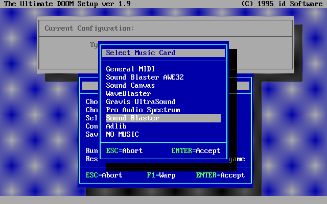
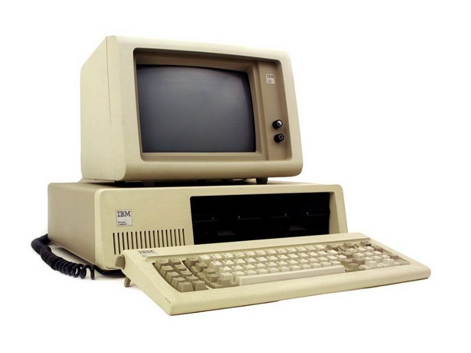
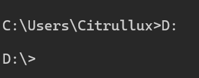
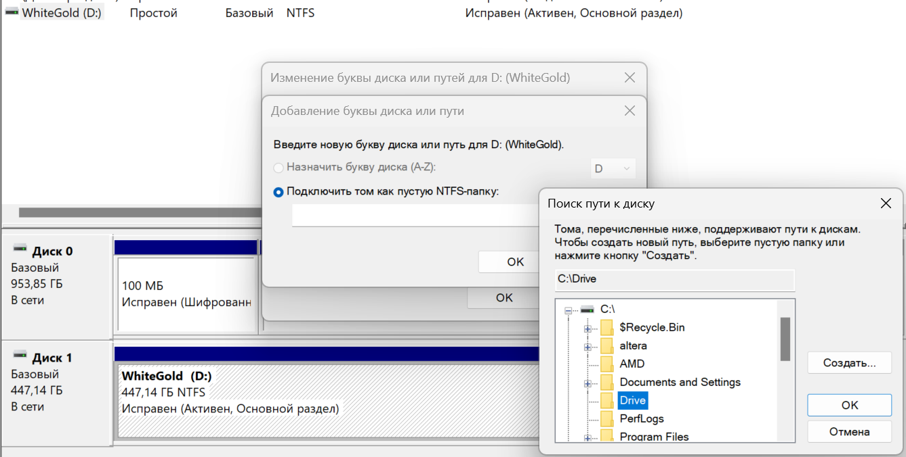
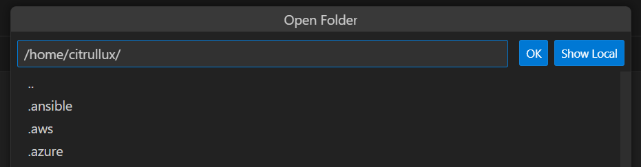
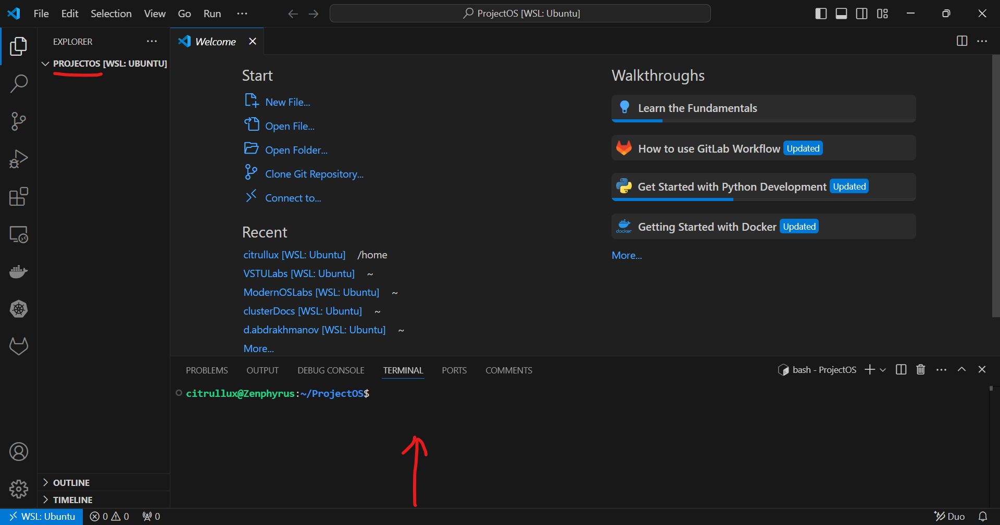
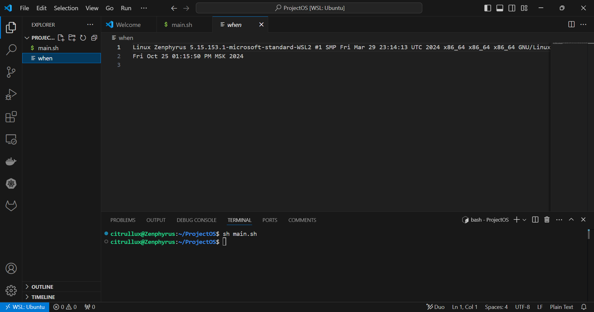

# Лабораторная работа: Использование системных инструментов и языка высокого уровня

Лабораторная на доработке, будет посвящена работе над проектом, представленным по ссылке ниже:

__[Текущая версия проекта для скачивания](https://cluster.vstu.ru/git/citrullux/ModernOSWeather)__

Задания в данной работе идут между текстом глав для лучшего понимания контекста приводимой теоретической базы. Они помечаются следующим образом:

#### № Задание
___

В отчёте по лабораторной работе нужно прикладывать номера заданий в ходе работы.

## Введение

С момента основания компьютерной индустрии под взаимодействием пользователей с электронно вычислительной машиной (далее ЭВМ) понимается использование устройств предназначенных для __ввода__ с целью получения от неё какого либо __вывода__ через соответствующие устройства.

Если говорить более простым языком:

> Пользователь что-то подаёт ожидая какой-либо реакции на свои действия

К примеру, если мы печатаем текст в текстовом редакторе Google Docs, мы ожидаем что каждый вводимый нами символ с клавиатуры будет отображаться в документе после его введения. При помощи мыши мы будем иметь возможность выделения частей текста для выполнения иных действий, таких как выжеления текста __жирным__, _курсивом_ или добавление <font color="#AAAAFF">иных</font> элементов и эффектов на страницу. При этом результат наших действий мы оцениваем при помощи экрана.

Данное описание применимо буквально для любого класса устройств, будь то наиболее распространённый вид ЭВМ на планете на момент написания этого материала, смартфон, или даже VR шлем. Разница заключается только в том, что на смартфоне в качестве "мыши" будет использоваться ввод через сенсорный экран, а в VR шлеме контроллеры или даже пальцы рук, которые современные шлемы умеют обнаруживать.

Клавиатура и экран как концепция в современных устройствах есть буквально везде. Если же у устройства их нет, то мы взаимодействуем с ними при помощи устройств у которых они есть. Если у вас когда-либо был робот пылесос, то скорее всего вы управляли им через ноутбук или смартфон у которых есть экран и клавиатура.

В экзотических сценариях в дополнение к уже перечисленным средствам могут использоваться иные устройства ввода, к примеру, мало кто использует клавиатуру для управления игрушечной машинкой, куда проще и точнее для этого использовать какой-либо контроллер.

> И на 4 абзаце этой стены текста возникает закономерный вопрос - __а при чём тут вообще курс _операционных систем_-то?__

## Глава 1 - Ввод/Вывод

Давайте ответим для себя на простой вопрос - вот когда мы вводим что-то с клавиатуры мы взаимодействуем с операционной системой?

Распространённый ответ на этот вопрос у студентов - ну конечно-же __да__, ведь вот на экране __операционныя система(ОС)__, будь то  Linux, Windows, macOS, Android, iOS _и дальше можно перечислять до бесконечности_, разве взаимодействие с ОС через экран, клавиатуру и другие устройства ввода не значит само по себе взаимодействие с ОС?

С какой-то стороны звучит такая позиция очень разумно. Но есть ньюанс.

__Вернёмся к первой аналогии__

Когда мы используем Google Docs чтобы редактировать документ, чем принципиально для нас, как пользователя, отличается взаимодействие с Google Docs на Windows, Linux, macOS и даже на Android и iOS?

> Мы везде используем __клавиатуру__, и некое __устройство ввода нажатий__ на область экрана чтобы редактировать текст и добавлять или удалять со страницы элементы.

И получается, что принципиальной разницы от изменения операционной системы мы как пользователь не получаем.

Ведь мы как пользователь работаем не с операционной системой, а с конкретным приложением, скорее всего Google Docs у вас открыт в браузере, который открыт на рабочем столе, <font color="#88CC88">_ну или поверх варианта X-org/Wayland сессии или чего бы то там ни было на macOS_</font>, который сам по себе тоже является приложением!

Так что же такое __операционная система__ и __что конкретно__ она в данном случае __делает?__

## Глава 2 - Идём от запуска

Вы никогда не задумывались что вообще происходит когда мы запускаем компьютер? Я не говорю о инициализации устройст BIOS или UEFI. Но после них начинает загружаться сама ОС.

Всё то время пока мы смотрим на красивое лого производителя данного компьютера если у нас UEFI или наслаждаемся красивым логотипом установленной операционной системы, ведь всё это время что-то происходит.

В целом администраторы которым нужно понимать что конкретно происходит с системой во время загрузки, либо смотрят в журнал ОС если она вообще запускается, либо включают отображение дампа загрузки вместо красивого графического отображения операционной системы.

В случае закрытых операционных систем мы точно не знаем что конкретно они делают, но в случае с Linux всё довольно очевидно.

> В глубину мы тут не полезем ибо оно особо не нужно нам на этом курсе...

Для понимание дальнейшего описания нужно понимать простую концепцию

__Linux__ это __не операционная система__.

__Linux__ это __ядро__. Вокруг которого операционная система может быть построена.

<blockquote>

Вы наверняка слышали про Android. В основе Android лежит ядро Linux, только вот весь софт который ядро окружает и конкретная Java машина сделаны компанией Google.

Существуют и другие оболочки, Ubuntu, Red Hat, GNU и прочее. Разница между этими операционными системами состоит в тех приложениях, которые доступны по умолчанию и особенностях взаимодействия с конкретной операционной системой.

Обычно системы на Linux в профессиональной среде называются как __Android/Linux__ __Ubuntu/Linux__ и __GNU/Linux__.

Кстати, если бы Windows именовалась схожим образом то она должна была бы называться __Windows98/DOS__ __Windows11/NT__ а macOS - __MacOS/XNU__.

</blockquote>


Задача __загрузки ОС__ по-сути состоит в __запуске приложения__ с которым будет __взаимодействовать__ пользователь.

Для того чтобы приложение, с которым пользователь хочет взаимодействовать, могло работать как надо, оно должно иметь возможность получать данные с ввода и передавать данные на вывод.

И в целом мысль состоит бы в том что надо просто дать приложению возможность взаимодействовать с вводом и выводом как оно захочет, и всё будет хорошо.

> Но в данной концепции работы приложений есть определённая проблема.

## Глава 3 - Интерфейс программирования приложения (API)



Рисунок 1 - Окно конфигурации звука DOS

Перед вами окно конфигурации звука для DOS версии игры Doom, и это прямой пример того, что случается, когда мы оставляем взаимодействие с чем-либо на программу вместо того чтобы работать посредством операционной системы.

Проблема, которую обозначает этот рисунок заключается в том, что для поддержки вывода звука из игры нужно всего-лишь написать собственную реализацию кода взаимодействия для каждой конкретной звуковой карты.

И если реализация для конкреной звуковой карты не была написана разработчиком, то с такой звуковой картой звука вы из Doom на DOS получить не могли.

И надо понимать, что если каждый разработчик должен будет самостоятельно реализовывать поддержку всего оборудования, то больше времени он будет уделять написанию кода поддержки, нежели созданию самого приложения.

Потому в операционной системе есть такая вещь как API, по-сути это набор приложений и функций с которыми может взаимодействовать ваше приложение посредством некоторого интерфейса, а уже их задача как-либо взаимодействовать с оборудованием.

Если вы когда-нибудь наблидали на коробке видеокарты или любого другого оборудовая что оно совместимо с DirectX или OpenGL/OpenAL или Vulkan то вы видели прямое указание возможности взаимодействия с этими устройствами посредством данных API.

Но в целом DOS тоже был операционной системой, которая обеспечивала некоторые взаимодействия без вмешательства программиста.

К примеру работа с диском, возможность выводить звук на PC-speaker и изображение на экран, взаимодействие с клавиатурой были заложены в операционную систему как готовые API.



Рисунок 2 - IBM PC

Такой набор возможностей во многом обусловлен тем, чем являлся IBM PC на начале своего пусти - простым домашним компьютером с монитором, клавиатурой и PC-спикером для вывода звука.

Подводя итоги:

>__Операционная система__ - это набор приложений и  ядро, задача которых предоставление другим приложениям возможности работать с определённым оборудованием и взаимодействовать с другими приложениями и/или пользователем.

Если взять представленное определение - то работа с операционной системой с точки зрения как пользователя так и администратора состоит в использовании различных приложений в целях достижения определённых результатов.

И в целом, можно было бы прямо сейчас открыть Linux консоль и начать просто вводить какие-либо команды рассматривая что они делают, но это не так интересно. Нужно написать что-то интересное и нужное, но чтобы понимать что конкретно мы делаем и почему, нужно дать немного информации на примерах.

Давайте начнём с одной из основных концепций в Linux.

## Глава 4 - Работа с файловой системой

В целом довольно плохо начинать изучение файловой системы в Linux с приведения Windows в аналогию, но для большей понятности мы поступим именно так.

Да и возможно содержимое пункта 4.1 будет даже для вас некоторым новым материалом.

### 4.1 Понятный большинству подход и его "особенности"

Для тех кто работал с Windows и представляет файловую систему как что-то начинающееся с имени диска, к примеру, `C:` требуется понять что такая концепция характерна __только__ для Windows.

В Windows мы можем перейти с диска `C:` на диск `D:` просто вписав в консоль `D:` и если у нас есть диск с такой буквой, консоль переключится на другой диск.



Рисунок 3 - Пример смены диска

Также переходя в диспетчер файлов в левой части окна мы можем видеть список наших дисков, что очень удобно. И те, кто пользовался Windows примерно всегда знают что а диске `C:` можно найти папки Windows, Program Files и Users, а остальное будет опционально.

Неизменным остаётся только один факт - все папки внутри диска `C:` должны находиться на __одном__  физическом диске ну или на массиве дисков объединённых в __один__ если мы имеем дело с RAID.

> Однако то что написано в прошлом абзаце - __неправда__

Механизм Windows действительно подразумевает создание нового диска при попытке подключения нового раздела или диска, однако если пойти в инструмент __управление компьютером__ и перейти в __управление дисками__ можно немного удивиться.



Рисунок 4 - Подключение диска как папки.

Да, можно просто подключить диск как папку на другом диске, и это даже будет работать. Однако изначальная папка, куда мы хотим смонтировать наш диск должна быть пустой.

А для Linux такой менанизм взаимодействия является __базовым__.

### 4.2 Файловая система в Linux. Основы

__"Всё есть файл."__ - это основная концепция ОС на базе ядра Linux.

В Linux со любым ресурсом который у вас есть можно взаимодействовать как с файлом, в том числе с устройствами.

В Linux всё начинается с корня - `/`

Корневая файловая система в Linux содержит в себе все файлы операционной системы, из корня можно перейти в каждую директорию и файл.

В базовой комплектации в директории `/` содержатся следующие поддиректории:

```
/bin /dev /home /media /proc /sbin /sys /var /boot /etc /lib /mnt /root /tmp /lib64 /opt /run /usr
```

Если в Windows чтобы посмотреть на имеющиеся устройства мы должны пойти в диспетчер устройств, то в Linux можно просто перейти в директорию `/dev` и увидеть все устройства которые система обнаружила в виде файлов.

Из этих файлов можно считывать информацию, а также можно попытаться в них что-то записывать.

> Автор данного материала крайне __не рекомендует__ что-либо записывать в файлы устройств, все возможные наносимые __повреждения__ операционной системе от использования _sudo_ или _root_ в результате таких действий остаются на __ответственности пользователя__.

В пункте 4.1 я приводил некоторые папки Windows, их очень примерными аналогами в Linux являются:

`C:/Users -> /home`

```
C:/ProgramFiles ->
/bin /sbin
/usr/bin /usr/sbin
/opt
```

`C:/Windows -> /sys`

Но всё это очень примерно, так как подходы операционных систем отчичаются, и значимо. Это скорее приведено чтобы знать где примерно искать.

В Linux каждая из этих директорий находящихся в `/`, будь то `/home`, `/bin`, `/boot` или любая другая может представлять из себя совершенно другой диск, который смонтирован как папка.

Получается что всё что находится в конкретной директории (включая вложенные директории) будет располагаться на другом диске если директория туда смонтирована. Но также любая из вложенных директорий может быть смонтирована на третий диск и.т.д.

### 4.3 Файловая система в Linux. Домашняя директория

Когда в Linux мы как пользователь открываем терминал перед нами обычно предстаёт консоль которая выдаёт нам имя нашего пользователя, название компьютера, текущий путь и текущие права.

В случае автора материала это обычно выглядит так:

`citrullux@Zenphyrus:~$`

Здесь:

`citrullux` - имя пользователя

`Zenphyrus` - название компьютера

`~` - указание на домашнюю директорию

`$` - текущие права, обычный пользователь , права суперпользователя выглядят так: `#`

Сейчас нас интересует домашняя директория.

Когда пользователь создаётся в системе, обычно ему присваивается некоторая директория, все файлы в которой будут принадлежать ему, _если не сказано обратное_.

Обычно домашняя директория пользователя находится по пути `/home/имя_пользователя/` и переход в неё приводит обозначение текущей директории к `~`.

#### 4.3.1 Задание
___

Давайте посмотрим на некоторые базовые вещи в работе файловой системы.

Откроем Visual Studio Code и подключимся к WSL (если вы в Windows10/11 с установленным WSL 2) и откроем домашнюю директорию:

`(Open Folder) -> /home/имя_пользователя`.



Рисунок 5 - Открытие директории

После открытия директории нажмите около её названия на кнопку `New Folder` и создайте директорию с названием `ProjectOS` или назовите по своему желанию.

Теперь откроем созданную нами директорию проекта

`(Open Folder) -> /home/имя_пользователя/ProjectOS/`

И потяните за нижнюю часть окна Visual Studio Code чтобы открыть терминал как показано на рисунке 6.



Рисунок 6 - Открытая директория с проектом.

Обычно терминал должен открыться сразу в нужном расположении: `~/ProjectOS/`, если этого не произошло, в терминале выполните команду `$ cd ~/ProjectOS/`

Команда `cd` предназначена для перехода из директорию в другую директорию.

Создадим в директории новый файл `main.sh`

Можно сделать это из интерфейса VSCode `(New File)`

Либо используя терминал `$ touch main.sh`

Давайте попробуем некоторые команды в терминале

`$ uname -a` - Покажет версию ядра системы и всю информацию о нём

`$ date > when` - Узнает текущую дату и время и запишет в файл `when`, тут `>` - это указание на запись результата операции в определённый файл.

Можно открыть файл `when` и посмотреть на данные внутри файла.

Зайдём в файл `main.sh` в VSCode и запишем в него следующее:

```
#!/bin/bash

uname -a > ./when
date >> ./when
```

Это скрипт, который используя среду исполнения /bin/bash выполняет 2 терминальных команды.

Выполним его в терминале при помощи:

`$ sh main.sh`

После завершения выполнения можно просмотреть файл `when` и увидеть его содержимое. не забудьте привести содержимое файла в вашем отчёте.



Отличие `>` от `>>` состоит в том, что первый оператор полностью перезаписывает файл новыми данными, а второй добавляет в уже существующий файл ещё одну строку.

Потому мы получили в одном файле версию ядра и текущее время.

Теперь перейдём к созданию дирректорий

Изменим `main.sh`:

```
#!/bin/bash

mkdir -p scripts
mkdir -p outputs

ls -lai . > ./outputs/dirstat

mv when ./outputs/when
mv main.sh ./scripts/main.sh
```

Выполнив текущую версию скрипта мы получим новосозданные папки командами `mkdir`.

Скрипт `main.sh` станет недоступным после исполнения. Надо будет закрыть отсутствующий файл в VSCode и открыть его по пути `scripts/main.sh`.

Команда `mv` перемещает файл в другую директорию.

Изменим `main.sh` ещё раз.

```
#!/bin/bash

ls -lai ../scripts >> ../outputs/dirstat
```

И попробуем запустить из консоли `$ sh scripts/main.sh`

<blockquote>

И да, вывод этой команды будет ошибочным:

`ls: cannot access '../scripts/': No such file or directory`

</blockquote>

Проблема в том, что __мы__ запускаем скрипт из директории, в которой путь `../scripts` не существует.

То есть, если попробовать выполнить `cd ../scripts` в терминале - то ничего не сработает.

Потому перепишем файл `main.sh` следующим образом:

```
#!/bin/bash
SCRIPT=$(readlink -f "$0")
DIR=$(dirname "$SCRIPT")

cd $DIR
ls -lai ../scripts >> ../outputs/dirstat
```

И запустим `$ sh scripts/main.sh`

Итак, мы имеем на текущий момент проект в Visual Studio Code в котором есть один файл кода на языке shell в каталоге `scripts`, и 2 файла простого текста в каталоге `outputs`.

А теперь, после всех этих пунктов вернёмся к теории.

### 4.4 Файловая система в Linux. А что вообще такое файл?

Если взглянуть в финальный файл `dirstat`, который располагается в директории `outputs` то можно в нём увидеть содержание схожее с текущим.

```
total 24
97240 drwxr-xr-x  4 citrullux citrullux 4096 Oct 29 17:55 .
477 drwxr-x--- 30 citrullux citrullux 4096 Oct 28 17:50 ..
97252 -rw-r--r--  1 citrullux citrullux  130 Oct 29 17:55 main.sh
27342 drwxr-xr-x  2 citrullux citrullux 4096 Oct 29 17:55 outputs
27339 drwxr-xr-x  2 citrullux citrullux 4096 Oct 29 17:55 scripts
97283 -rw-r--r--  1 citrullux citrullux  150 Oct 25 14:15 when

total 12
27339 drwxr-xr-x 2 citrullux citrullux 4096 Oct 29 17:55 .
97240 drwxr-xr-x 4 citrullux citrullux 4096 Oct 29 17:55 ..
97252 -rw-r--r-- 1 citrullux citrullux  113 Oct 29 18:08 main.sh
```

Давайте внимательно рассмотрим содержимомое.

___

Команда с флагом `-lai` подразумевает отображение всех файлов в текущей директории с отображением инжексов файлов.

В первой команде `$ ls -lai`

Файл `main.sh` отображался следующим образом:

`97252 -rw-r--r--  1 citrullux citrullux  130 Oct 29 17:55 main.sh`

После переноса в другую директорию он выглядит так:

`97252 -rw-r--r-- 1 citrullux citrullux  113 Oct 29 18:08 main.sh`

Первое значение - это индекс файла.

В моём варианте значение равно `97252` для обоих файлов.

Структара файлов, где файлы вложены в директории, является __красивым представлением__ для пользователя, с точки зрения операционной системы файлы просто находятся на смонтированном диске и им __присвоен какой-либо номер__ начиная с 1.

Файл является одним и тем же с точки зрения системы, __перенос__ командой `mv` из дирректории в дирректорию __не приводит__ к изменению файла на диске.

При __копировании__ файла командой `cp` будет создан __новый файл__ на диске и им будет получен __новый индекс__.

### 4.4 Файловая система в Linux. Директории.

Среди обычных файлов в команде `ls -lai` отдельно стоит обсудить обозначения нестандартных файлов.

Поскольку в Linux всё есть файл, то директория и ссылка и даже устройства, это тоже файлы.

Команда `ls -lai` отображает тип файла на отмеченной позиции.

27339 <font color="#FF5555">d</font>rwxr-xr-x  2 citrullux citrullux 4096 Oct 29 17:55 scripts

Значения данного показателя могут быть следующими:

```
- Обычные файлы
d Каталоги
l Символьные ссылки
b Блочные устройства
c Символьные устройства
p Каналы
s Сокеты
```

И в данном случае `scripts` - это директория.

Директория `scripts` вложена в директорию `ProjectOS`.

В любой директории всегда есть 2 файла
`.` и `..`

Внутри директории `scripts` данные файлы выглядят следующим образом:

```
27339 drwxr-xr-x 2 citrullux citrullux 4096 Oct 29 17:55 .
97240 drwxr-xr-x 4 citrullux citrullux 4096 Oct 29 17:55 ..
```
Эти 2 файла являются директориями.

А теперь рассмотрим директорию `ProjectOS`.

```
total 24
97240 drwxr-xr-x  4 citrullux citrullux 4096 Oct 29 17:55 .
477 drwxr-x--- 30 citrullux citrullux 4096 Oct 28 17:50 ..
27339 drwxr-xr-x  2 citrullux citrullux 4096 Oct 29 17:55 scripts
```

В данном выводе мы видим, что директория `scripts` имеет индекс `27339`. А в самой директории `scripts` файл `.` имеет ровно такой-же индекс `27339`.

Это значит что команда `$ cd scripts` выполненная в директории `ProjectOS` и команда `cd .` выполненная из директории `scripts` приведут к переходу в директорию `scripts`.

То есть файл `.` в составе директории указывает на саму директорию.

Файл `..` в директории scripts выглядит следующим образом:

`97240 drwxr-xr-x 4 citrullux citrullux 4096 Oct 29 17:55 ..`

И индекс этого файла совпадает с индексом файла `.` в директории `ProjectOS`

`97240 drwxr-xr-x  4 citrullux citrullux 4096 Oct 29 17:55 .`

То есть выполнение `cd ..` из любой директории приведёт к переходу на директорию выше.

Помимо этих файлов в директории находится информация о индексах файлов для которых текущая директория является __"местоположением"__.

Примерно так и работают директории.

### 4.5 Файловая система в Linux. Ссылки, жёсткие и мягкие.

В Linux есть система мягкий и жёстких ссылок.

Если вы когда-либо работали со ссылками в Windows, то вы примерно представляете что из себя представляет мягкая ссылка: это просто указание точного пути до файла, к которому нужно обратиться при обращении любого приложения к ссылке.

Жёсткая ссылка - это и есть сам файл. И сразу это не так очевидно.

#### 4.5.1 Задание

Давайте вернёмся в наш редактор и продолжим изменять файл `main.sh`

```
#!/bin/bash
SCRIPT=$(readlink -f "$0") # Полный путь до скрипта
DIR=$(dirname "$SCRIPT") # Директория нахождения скрипта

cd $DIR # Переход в директорию скрипта
cd .. # Переход в директорию проекта

# Создаём директорию и переходим в неё
mkdir -p data
cd data
echo "Hello world!" > world # Создаём файл с названием world
ln -f world flat # Создаём жёсткую ссылку
ln -s -f world globe # Создаём мягкую ссылку

# Читаем содержимое файлов в файл links
cat world > ../outputs/links
cat flat >> ../outputs/links
cat globe >> ../outputs/links
# Просматриваем состав директории
ls -lai >> ../outputs/links
```

Сохраним и исполним файл `$ sh scripts/main.sh`

Теперь изменим файл `main.sh` следующим образом:

```
#!/bin/bash
SCRIPT=$(readlink -f "$0") # Полный путь до скрипта
DIR=$(dirname "$SCRIPT") # Директория нахождения скрипта

cd $DIR # Переход в директорию скрипта
cd .. # Переход в директорию проекта
cd data

echo "Place where human lives" > world # Изменяем данные в файле world

# Читаем содержимое файлов в файл links
cat world >> ../outputs/links
cat flat >> ../outputs/links
cat globe >> ../outputs/links

echo "Is this flat?" > flat # Изменяем данные в файле flat

# Читаем содержимое файлов в файл links
cat world >> ../outputs/links
cat flat >> ../outputs/links
cat globe >> ../outputs/links

echo "Think different" > globe # Изменяем данные в файле globe

# Читаем содержимое файлов в файл links
cat world >> ../outputs/links
cat flat >> ../outputs/links
cat globe >> ../outputs/links
```

Сохраним и исполним файл `$ sh scripts/main.sh`

Снова изменим файл `main.sh`

```
#!/bin/bash
SCRIPT=$(readlink -f "$0") # Полный путь до скрипта
DIR=$(dirname "$SCRIPT") # Директория нахождения скрипта

cd $DIR # Переход в директорию скрипта
cd .. # Переход в директорию проекта
cd data

echo "Ready to destroy" > world # Изменяем данные в файле world
rm world # Удаляем файл
cat flat >> ../outputs/links
cat globe >> ../outputs/links

# Просматриваем состав директории
ls -lai >> ../outputs/links
```

Сохраним и исполним файл `$ sh scripts/main.sh`

Скорее всего в результате выполнения будет выдана ошибка:
`cat: globe: No such file or directory`

#### Разбор практического блока
___

Откройте в директории `data` файл `links`.

По результатам выполнения практического блока, в файле находятся следующие строки:

```
Hello world!
Hello world!
Hello world!
```
первые 3 строки содержат в себе надпись "Hello world!". Это результат выполнения команд:

```
cat world > ../outputs/links
cat flat >> ../outputs/links
cat globe >> ../outputs/links
```

Которые считывают данные из 3 файлов, world, flat и globe, далее обозначена выдача команды `ls -lai` в которой нас интересуют следующие строки:

```
28332 -rw-r--r-- 2 citrullux citrullux   13 Nov  1 16:11 flat
35272 lrwxrwxrwx 1 citrullux citrullux    5 Nov  1 16:11 globe -> world
28332 -rw-r--r-- 2 citrullux citrullux   13 Nov  1 16:11 world
```

Как можно понять файлы `world` и `flat` это один и тот же файл, поскольку индекс `28332` __совпадает__ для __обоих файлов__, и да, у вас этот индекс _скорее всего_ для обоих файлов будет также __одинаковым__, но другим.

С другой стороны файл `globe` представляет из себя мягкую ссылку, у него иной индекс. А сам файл в `ls -lai` имеет тип `l` и обозначается как `globe -> world`, то есть файл `globe` ссылается на файл `world`, пока файл `world` продолжает существовать.

35272 <font color="#FF5555">l</font>rwxrwxrwx 1 citrullux citrullux    5 Nov  1 16:11 <font color="#FF5555">globe -> world</font>

Команда `ls -lai` отображает количество жёстких ссылок на файл на отмеченной позиции.

28332 -rw-r--r-- <font color="#FF5555">2</font> citrullux citrullux   13 Nov  1 16:11 world

28332 -rw-r--r-- <font color="#FF5555">2</font> citrullux citrullux   13 Nov  1 16:11 flat

И как можно увидеть для файла `world` и файла `flat` количество ссылок равно 2. А по факту оба файла представляют из себя файл `28332` расположенный на диске.

В ОС на базе ядра Linux любой файл окончательно удаляется с диска в тот момент, когда на него не остаётся ни одной жёсткой ссылки.

